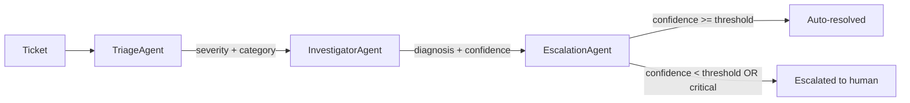

# agentops-triage-kit

A small, dependency-free demo of a **multi-agent triage & escalation pipeline** — the pattern behind a lot of "AI ops" tooling: incoming tickets get classified, investigated against known issue patterns, and either auto-resolved or handed to a human, with a full audit trail at every step.

This is a portfolio/demo project. It's original code, not derived from any employer or client system — it's meant to show the shape of a problem I've worked on professionally (automating triage/escalation for engineering and support workflows), built from scratch as a clean, standalone example.

## Why this pattern

Fully autonomous "AI agents" are easy to demo and hard to trust in production. The interesting engineering problem isn't the model call — it's the pipeline around it: how confident does an agent need to be before it acts unsupervised, what gets logged for audit, and where's the seam that lets you swap a rule-based stub for a real model without touching the orchestration.

This project is a minimal, readable answer to that problem.

## Architecture



Three single-responsibility agents run in a fixed pipeline:

- **TriageAgent** — classifies severity (low/medium/high/critical) and category (auth/integration/infrastructure/data) from the ticket text.
- **InvestigatorAgent** — matches the ticket against a small runbook of known issue patterns and proposes a diagnosis + next step, each with a confidence score.
- **EscalationAgent** — the policy gate: critical tickets always go to a human; everything else auto-resolves only if the investigation's confidence clears a threshold (`MIN_AUTO_RESOLVE_CONFIDENCE`, default `0.7`).

Every agent appends an `Action` to the ticket's `Report`, so the final output is a full audit trail of what each agent decided and why — not just a final verdict.

### The LLM seam

Every agent accepts an optional `brain: LLMClient | None`. By default it's `None` and agents fall back to deterministic rules, which is what keeps this project dependency-free, fast, and fully unit-testable offline. `agentops/brain.py` defines the `LLMClient` protocol — implement `.complete(prompt) -> str` against whatever provider you use and pass it to `Orchestrator(brain=...)` to swap in real model calls without touching any orchestration logic.

## Project layout

```
src/agentops/
  models.py        # Ticket, Action, Report, Severity, Category
  agent.py         # Agent base class
  brain.py         # LLMClient protocol (the rule-based <-> model seam)
  runbook.py       # known-issue knowledge base + matcher
  orchestrator.py  # runs the agent pipeline
  agents/
    triage.py
    investigator.py
    escalation.py
examples/
  tickets.json     # sample synthetic tickets
  run_demo.py      # CLI entry point
tests/
  test_orchestrator.py
  test_runbook.py
```

## Running it

```bash
python examples/run_demo.py
```

```bash
pip install -e ".[dev]"
pytest
```

No API keys or external services required — everything runs locally.

## Example output

```
Ticket T-1004: Full outage - all services down
  severity=critical category=unknown
  [triage] classified as critical/unknown (confidence=0.40)
  [investigator] no matching known issue found (confidence=0.20)
  [escalation] escalated to human (confidence=1.00)
  -> escalated to human

Ticket T-1003: User can't log in, token expired error
  severity=high category=auth
  [triage] classified as high/auth (confidence=0.90)
  [investigator] Likely an expired or misconfigured auth credential. (confidence=0.80)
  [escalation] auto-resolved (confidence=0.80)
  -> resolved
  recommendation: Verify token/key expiry and rotation schedule for the affected integration.
```

## Extending it

- Add a new `Agent` subclass and slot it into `Orchestrator(agents=[...])`.
- Replace `runbook.match()` with a real knowledge base (vector search over past incidents, a wiki API, etc.) — the `InvestigatorAgent` interface doesn't change.
- Implement `LLMClient` and pass `brain=` to any/all agents to move from rules to model calls incrementally, one agent at a time.

## License

MIT — see [LICENSE](LICENSE).
