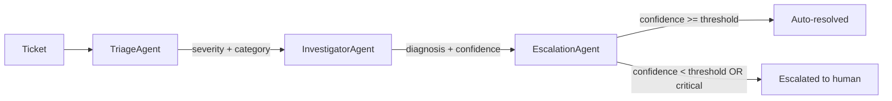
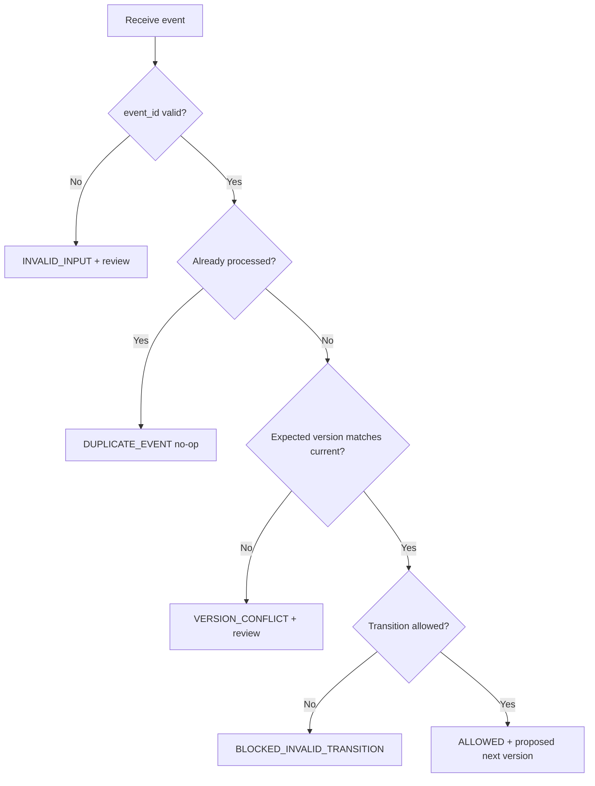

# agentops-triage-kit
[](https://github.com/monicaslgc/agent-triage-kit/actions/workflows/tests.yml)

A small, dependency-free demo of a multi-agent triage and escalation pipeline. Tickets come in, get classified, get checked against known issue patterns, and either get auto-resolved or handed off to a human, with a full audit trail along the way.

This is a portfolio project, not a copy of anything I've built at work. It's original code from scratch, meant to show the shape of a problem I deal with professionally (automating triage/escalation for engineering and support workflows) without pulling in any actual employer or client code.

## Why this pattern

Autonomous "AI agents" are easy to demo and hard to actually trust. In my experience the hard part was never the model call itself, it's the pipeline around it: how confident does an agent need to be before it's allowed to act without a human, what gets logged so you can audit it later, and where do you leave room to swap a rule-based stub for a real model without rewriting the orchestration.

This project is my attempt at a minimal, readable answer to that.

## Architecture


```mermaid
flowchart LR
    T[Ticket] --> TR[TriageAgent]
    TR -->|severity + category| INV[InvestigatorAgent]
    INV -->|diagnosis + confidence| ESC[EscalationAgent]
    ESC -->|confidence >= threshold| AR[Auto-resolved]
    ESC -->|confidence < threshold OR critical| HU[Escalated to human]
```

Three agents run in a fixed pipeline, each with one job:

- **TriageAgent** classifies severity (low/medium/high/critical) and category (auth/integration/infrastructure/data) from the ticket text.
- **InvestigatorAgent** checks the ticket against a small runbook of known issue patterns and proposes a diagnosis plus a next step, with a confidence score attached.
- **EscalationAgent** is the actual policy gate. Critical tickets always go to a human. Everything else only auto-resolves if the investigation's confidence clears a threshold (`MIN_AUTO_RESOLVE_CONFIDENCE`, 0.7 by default).

Every agent appends an `Action` to the ticket's `Report`, so what you get at the end isn't just a verdict, it's a trail of what each step decided and why.

### The LLM seam

Each agent takes an optional `brain: LLMClient | None`. Left as `None` (the default here), agents fall back to plain rules, which is why this whole thing runs offline with no dependencies and is easy to unit test. `agentops/brain.py` defines the `LLMClient` protocol; implement `.complete(prompt) -> str` for whatever provider you're using and pass it to `Orchestrator(brain=...)` to move from rules to real model calls. None of the orchestration logic has to change either way.

## Order lifecycle consistency example

A second, self-contained portfolio example demonstrates a deterministic back-office workflow for order events. It validates the state transition, identifies duplicate event IDs, and blocks updates based on stale order versions. The examples are synthetic; this is not a live commerce integration or an implementation of any employer's system.


```mermaid
flowchart TD
    A[Receive event] --> B{event_id valid?}
    B -->|No| I[INVALID_INPUT + review]
    B -->|Yes| C{Already processed?}
    C -->|Yes| D[DUPLICATE_EVENT no-op]
    C -->|No| E{Expected version matches current?}
    E -->|No| F[VERSION_CONFLICT + review]
    E -->|Yes| G{Transition allowed?}
    G -->|No| H[BLOCKED_INVALID_TRANSITION]
    G -->|Yes| J[ALLOWED + proposed next version]
```

- [Read the workflow, decision contract and acceptance criteria](./examples/order-lifecycle-consistency/README.md)
- [View the state machine source](./examples/order-lifecycle-consistency/workflow.mmd)
- [Try the deterministic policy implementation](./src/agentops/order_lifecycle.py)
- [Explore the reusable skill definition](./skills/order-lifecycle-consistency/SKILL.md)

The evaluator does not persist event IDs, update orders, increment stored versions, or trigger payment, cancellation, shipment, or refund actions. A real system would need an atomic event ledger and conditional version update to handle concurrent workers safely.

## Project layout

```
src/agentops/
  models.py             # Ticket, Action, Report, Severity, Category
  agent.py              # Agent base class
  brain.py              # LLMClient protocol (rule-based <-> model seam)
  runbook.py            # known-issue knowledge base + matcher
  orchestrator.py       # runs the ticket pipeline
  order_lifecycle.py    # deterministic order policy + idempotency/version checks
  agents/               # triage, investigator, escalation
examples/
  tickets.json
  run_demo.py           # ticket triage CLI
  order-lifecycle-consistency/
    README.md            # workflow, decisions, acceptance criteria
    orders.json          # synthetic edge-case fixtures
    workflow.mmd         # Mermaid state machine
  order_lifecycle_consistency/
    run_demo.py          # lifecycle CLI
skills/
  order-lifecycle-consistency/SKILL.md
tests/
  test_orchestrator.py
  test_runbook.py
  test_order_lifecycle.py
```

## Running it

```bash
pip install -e ".[dev]"
python examples/run_demo.py
python -m examples.order_lifecycle_consistency.run_demo
pytest
```

No API keys or external services are needed. Everything runs locally.

## Example output

```
Ticket T-1004: Full outage - all services down
  severity=critical category=unknown
  [triage] classified as critical/unknown (confidence=0.40)
  [investigator] no matching known issue found (confidence=0.20)
  [escalation] escalated to human (confidence=1.00)
  -> escalated to human

Ticket T-1003: User can't log in, token expired error
  severity=high category=auth
  [investigator] Likely an expired or misconfigured auth credential. (confidence=0.80)
  [escalation] auto-resolved (confidence=0.80)
  -> resolved
  recommendation: Verify token/key expiry and rotation schedule for the affected integration.
```

## Extending it

- Add a new `Agent` subclass and drop it into `Orchestrator(agents=[...])`.
- Swap `runbook.match()` for vector search over past incidents or a wiki API.
- Implement `LLMClient` and pass `brain=` to one agent at a time as you move from rules to real model calls.
- Extend the order workflow with a simulated atomic repository and concurrency race tests before considering any real integration.

## License

MIT, see [LICENSE](LICENSE).
