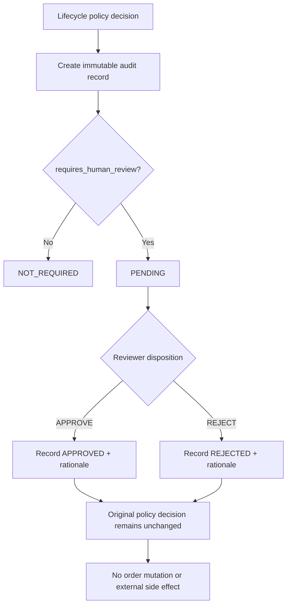

# Audit Trail + Human Review Workflow

A deterministic, backend-only portfolio demo showing how a workflow decision can be recorded and routed for explicit human review without allowing the reviewer action to silently mutate order state.

## Flow



## Run

```bash
python -m examples.audit_trail_human_review.run_demo
pytest
```

All IDs and timestamps are synthetic. This example does not persist audit records, update orders, or execute downstream actions. In a real system, durable append-only storage, access controls, integrity protection, retention rules, and atomic coordination with the state change would need separate design and testing.
