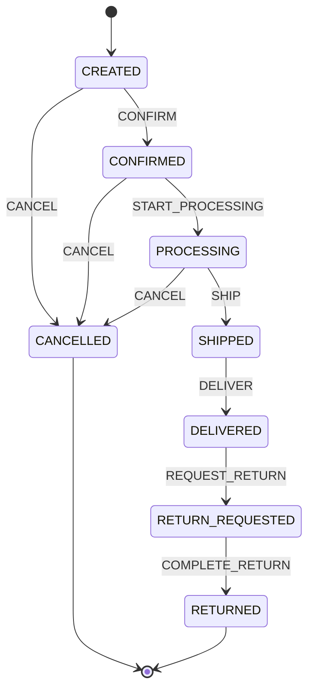
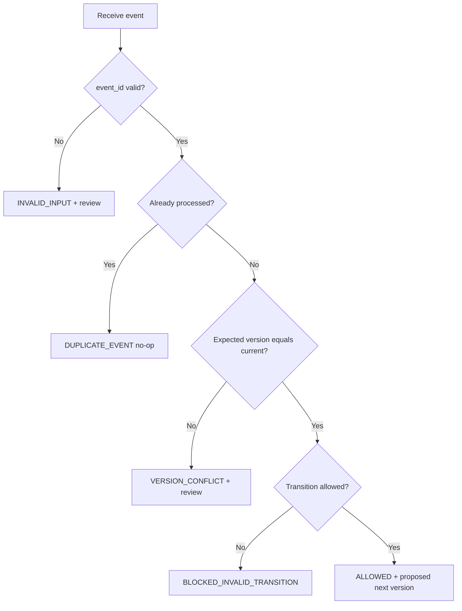

# Order Lifecycle Consistency — portfolio demo

> **Portfolio demonstration only.** This is an original, synthetic workflow designed to demonstrate product thinking and workflow validation. It is not a WellaOne implementation and does not contain employer or client data.

## Problem

Order workflows can become inconsistent when events arrive out of sequence, integrations retry requests, or two processes try to update the same order based on different versions. A safe workflow must reject invalid transitions, identify retries, and block stale writes before a downstream action is considered.

## What this demo does

- Defines an explicit order state machine and allowed events.
- Evaluates transitions deterministically; no LLM decides whether a transition is valid.
- Detects duplicate event IDs and returns a no-op decision.
- Checks an event's expected order version against the current version.
- Returns an explainable decision and proposed next state/version without mutating an order.
- Includes synthetic fixtures and automated tests for edge cases.
- Keeps the policy layer separate from integrations and side effects.

## Quick start

Requires Python 3.11+. From the repository root:

```bash
pip install -e ".[dev]"
python -m examples.order_lifecycle_consistency.run_demo
pytest
```

The demo prints seven synthetic cases, including a valid transition, invalid transition, terminal state, duplicate event, stale-version conflict, and invalid input. Each row reports whether the actual decision matches the fixture's expected result.

## State machine

See [workflow.mmd](./workflow.mmd) for the Mermaid source.



## Decision flow



## Example

```python
from agentops.order_lifecycle import evaluate_order_event

decision = evaluate_order_event(
    "CREATED",
    "CONFIRM",
    event_id="evt-1001",
    processed_event_ids=set(),
    expected_version=4,
    current_version=4,
)
assert decision.decision == "ALLOWED"
assert decision.next_status == "CONFIRMED"
assert decision.next_version == 5
```

## Decision values

- `ALLOWED`: the event is valid and the supplied version matches.
- `BLOCKED_INVALID_TRANSITION`: the event is not allowed from this status.
- `NEEDS_REVIEW_UNKNOWN_VALUE`: status or event is unknown.
- `DUPLICATE_EVENT`: the event ID is already recorded; no state change is proposed.
- `VERSION_CONFLICT`: a new event was based on a stale version; review/reconciliation is required.
- `INVALID_INPUT`: event ID or version metadata is missing or invalid.

## Important production boundary

This is a pure evaluator, not a production-grade distributed idempotency service. It does not persist processed IDs, lock records, update an order, or increment stored versions. In a real implementation, checking/recording the event ID and committing the state/version change must happen atomically (for example, with a database uniqueness constraint and conditional version update). A pre-read or in-memory collection alone cannot prevent races across multiple workers.

The policy is deterministic by design. An AI agent may explain an exception, but must not invent or override the approved transition rules. The demo never triggers payment, cancellation, shipment, refund, or customer communication.

## Acceptance criteria

- Valid events return the expected next status and proposed next version.
- Invalid transitions return no next status or next version.
- Duplicate event IDs are ignored without proposing another transition.
- New events with stale versions are blocked and flagged for review.
- Missing event IDs and invalid versions fail closed.
- Unknown statuses/events are rejected safely.
- Evaluation is deterministic and has no network or database dependency.

## Next iterations

- Add property-based tests for the transition table.
- Model an atomic repository interface and concurrency race tests without connecting to a real service.
- Add a machine-readable audit record for every decision.
- Add evaluation metrics for detection accuracy and false positives.
