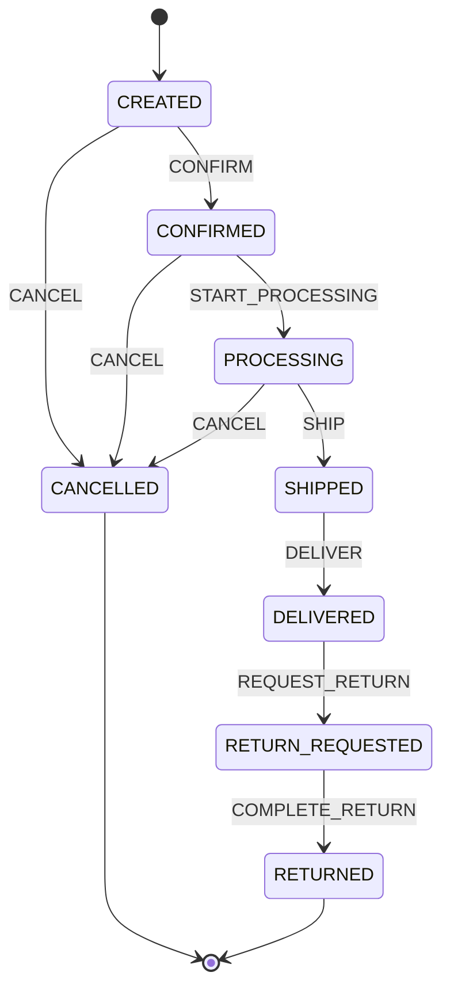

# Order Lifecycle Consistency — portfolio demo

> **Portfolio demonstration only.** This is an original, synthetic workflow designed to demonstrate product thinking and workflow validation. It is not a WellaOne implementation and does not contain employer or client data.

## Problem

Order workflows can become inconsistent when events arrive out of sequence, integrations retry requests, or a downstream system reports a state that is not valid for the order's current status. A workflow should distinguish a valid transition from a suspicious one before any downstream action is taken.

## What this demo does

- Defines an explicit order state machine and allowed events.
- Evaluates transitions deterministically; no LLM is used to decide whether a transition is valid.
- Returns a structured decision with the current state, event, proposed next state and reason.
- Includes synthetic examples and tests for valid, invalid and unknown transitions.
- Keeps the policy layer separate from any integration or side-effecting action.

## Quick start

Requires Python 3.11+. The runtime logic has no third-party dependencies. Install the package and test dependency from the repository root:

```bash
pip install -e ".[dev]"
python -m examples.order_lifecycle_consistency.run_demo
pytest
```

## State machine

See [workflow.mmd](./workflow.mmd) for the Mermaid source.



## Example

```python
from agentops.order_lifecycle import evaluate_transition

decision = evaluate_transition("CONFIRMED", "SHIP")
print(decision.allowed)  # False: processing must start before shipment
print(decision.reason)
```

## Design decisions

1. **Fail closed:** unknown statuses and events are rejected, not guessed.
2. **No hidden side effects:** evaluation returns a decision; it does not update an order or call external systems.
3. **Explainable outcomes:** every decision includes a human-readable reason.
4. **Policy before AI:** state integrity is a deterministic business rule. An LLM may help summarize an exception, but must not override the transition policy.
5. **Explicit scope:** retries/idempotency, payment reconciliation, inventory reservations, split shipments and real integration adapters are intentionally out of scope for this first demo.

## Acceptance criteria

- A valid event returns `allowed=true` and the expected next status.
- An invalid transition returns `allowed=false` and no next status.
- Unknown statuses/events are rejected safely.
- Terminal states cannot transition further.
- The evaluation is deterministic and has no network or database dependency.

## Next iterations

- Add event IDs and idempotency handling for duplicate messages.
- Add version checks to detect concurrent updates.
- Add property-based tests for the transition table.
- Add an exception-review queue without allowing the AI layer to change the policy decision.
